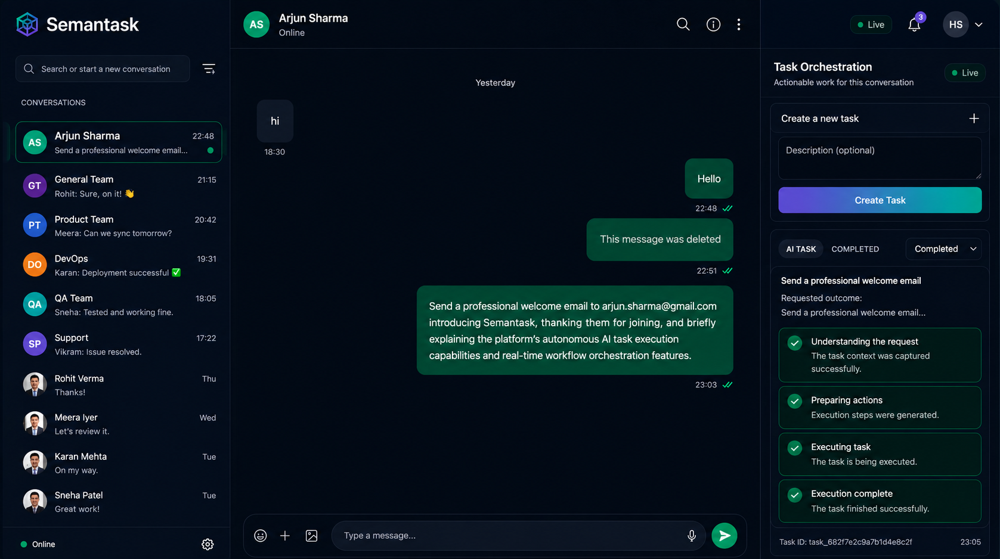
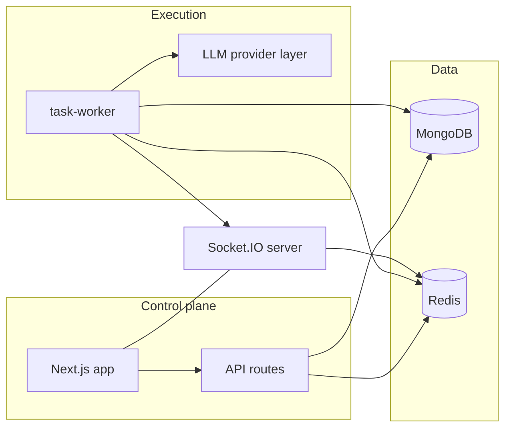

<div align="center">

# Semantask

**Autonomous task execution from conversation — production-grade, multi-provider, observable.**

[semantask.com](https://semantask.com)

[](https://nodejs.org/)
[](https://turbo.build/)
[](https://nextjs.org/)

*Originally seeded as a real-time collaboration stack; evolved into an orchestration platform with async workers, workflow semantics, and provider abstraction.*

</div>

<p align="center">
  
  <br />
  <sub>Task-triggered workflows with live <strong>Task Orchestration</strong> — async execution, step visibility, and run metadata.</sub>
</p>

---

## Overview

**Semantask** coordinates long-running agent work across **OpenAI-compatible APIs**, **Hugging Face** inference (Inference API and OpenAI-compatible endpoints), and **AMD-hosted OpenAI-compatible** inference — behind a single **provider abstraction** in the task worker. Jobs run **asynchronously** with **leases**, **retries**, and bounded timeouts; progress and outcomes surface through **real-time channels** for operational visibility.

Use it as a hackathon-grade reference architecture or as a starting point for open-source agent orchestration on a familiar Node.js + MongoDB + Redis foundation.

## Why Semantask

| Theme | What you get |
| --- | --- |
| **Provider abstraction** | Swap models and hosts without rewriting orchestration — OpenAI, generic OpenAI-compatible servers, Hugging Face, AMD-compatible endpoints. |
| **Async execution** | Work offloads to dedicated workers; APIs stay responsive while agents iterate. |
| **Real-time observability** | Live updates over the existing Socket.IO layer — suited for task dashboards and run timelines. |
| **Workflow orchestration** | Multi-step agent loops, tools, and structured outputs — built for dependable pipelines, not ad-hoc scripts. |
| **Reliability** | Timeouts, retries, and lease-style execution reduce stuck runs and silent failures. |

## Architecture



1. **Next.js** serves the UI and HTTP APIs; shared packages enforce validation and persistence.
2. **task-worker** runs autonomous tasks against the **LLM provider abstraction** (capabilities flags, structured outputs, tool calling where supported).
3. **MongoDB** stores durable task and domain state.
4. **Redis** backs coordination, queues, and scalable socket fan-out.
5. **Socket.IO** streams task and session updates for **real-time observability**.

For deeper LLM wiring (vLLM, TGI, HF endpoints, AMD), see [`apps/task-worker/OSS_INFERENCE_COMPATIBILITY.md`](apps/task-worker/OSS_INFERENCE_COMPATIBILITY.md) and [`docs/architecture/LLM_PROVIDER_ARCHITECTURE.md`](docs/architecture/LLM_PROVIDER_ARCHITECTURE.md). For the full system map (verified against runtime), see [`docs/ARCHITECTURE.md`](docs/ARCHITECTURE.md).

**Ingress note:** new chat messages are classified with **regex heuristics** in the task worker (`packages/services/task-intelligence.service.ts`), not an LLM. LLM providers are used during autonomous **task execution** (`task.execution.requested`).

## Platform stack

| Layer | Technology |
| --- | --- |
| Monorepo | **Turborepo** — unified build, cache-friendly pipelines |
| Web | **Next.js 15** — App Router, API routes, auth integration |
| Data | **MongoDB** — durable tasks and application state |
| Coordination | **Redis** — queues, presence-style coordination, socket scaling |
| Real-time | **Socket.IO** — streaming updates to connected clients |
| Containers | **Docker Compose** — nginx, web, socket, worker, MongoDB, Redis |

## Monorepo layout

```text
.
├── apps/
│   ├── web/           # Next.js — UI, APIs, auth flows
│   ├── socket/      # Socket.IO — real-time observability transport
│   ├── task-worker/ # Agent execution — LLM providers, retries, orchestration
│   └── mobile/      # React Native client (optional)
├── packages/
│   ├── auth/        # Shared auth utilities
│   ├── db/          # MongoDB models and access patterns
│   ├── redis/       # Redis helpers
│   ├── services/    # Domain logic, validators, repositories
│   └── types/       # Shared contracts and event shapes
├── docker/
├── nginx/
├── docker-compose.yml
└── turbo.json
```

## Prerequisites

- **Node.js** 20+
- **pnpm** 10+ (see `packageManager` in root `package.json`)
- **MongoDB** (replica set for production — see [`docs/operations/PRODUCTION_REQUIREMENTS.md`](docs/operations/PRODUCTION_REQUIREMENTS.md))
- **Redis** (required for production-like / multi-instance socket and task-worker dedupe)

## Environment configuration

Copy [`env.sample`](env.sample) to `.env` at the repository root and adjust for your environment.

**Core:** database, Redis, auth secrets, NextAuth, OAuth (optional), ImageKit (if media uploads are enabled), SMTP (optional).

**Agents / task-worker — multi-provider:** set `LLM_PROVIDER` and either OpenAI-style keys or provider-specific variables. The worker supports **OpenAI**, **OpenAI-compatible** bases (including **AMD** OpenAI-compatible hosts), and **Hugging Face** (Inference API or OpenAI-compatible endpoints). See `env.sample` for `LLM_*`, `TASK_*`, and optional `AMD_*` / `HUGGINGFACE_*` overrides.

```env
# Core (abbreviated — see env.sample for full list)
MONGODB_URI=mongodb://localhost:27017/semantask
NEXTAUTH_SECRET=replace_with_a_strong_secret
NEXTAUTH_URL=http://localhost:3000
INTERNAL_SECRET=replace_with_shared_internal_secret
ORIGIN=http://localhost:3000
REDIS_URL=redis://localhost:6379
NEXT_PUBLIC_SOCKET_URL=http://localhost:3001

# Agents — example multi-provider knobs (see env.sample)
LLM_PROVIDER=openai
OPENAI_API_KEY=
# OPENAI_BASE_URL=          # OpenAI-compatible / vLLM / custom gateway
# HUGGINGFACE_API_KEY=
# HUGGINGFACE_BASE_URL=
# AMD_API_KEY=
# AMD_BASE_URL=
```

## Local development

1. Install dependencies.

```bash
pnpm install
```

2. Start all workspaces in development mode.

```bash
pnpm run dev
```

3. Open the apps.

- **Web:** http://localhost:3000  
- **Socket server:** http://localhost:3001  

Run the task worker explicitly when developing agents in isolation:

```bash
pnpm run task-worker
```

## Scripts

| Script | Description |
| --- | --- |
| `pnpm run dev` | Development mode for apps and packages via Turborepo |
| `pnpm run build` | Production builds across workspaces |
| `pnpm run start` | Starts production targets where defined |
| `pnpm run lint` | Lint across workspaces |
| `pnpm run test` | Tests across workspaces |
| `pnpm run task-worker` | Dev mode for the agent/task worker |
| `pnpm run clean` | Cleans build artifacts via Turborepo |

## Docker

```bash
docker compose up --build
```

The Compose stack includes **nginx**, **nextapp** (Next.js), **socket**, **task-worker**, and **Redis**. **MongoDB is external** — set `MONGODB_URI` in `.env` to a reachable **replica set** for production task-worker retries. See [`docs/operations/PRODUCTION_REQUIREMENTS.md`](docs/operations/PRODUCTION_REQUIREMENTS.md).

## Troubleshooting

- **Ports 3000 / 3001 in use** — stop conflicting processes and restart dev servers.
- **Auth failures** — verify `NEXTAUTH_SECRET`, `NEXTAUTH_URL`, and cookie/domain settings.
- **Socket / live updates** — check `ORIGIN`, `INTERNAL_SECRET`, and `NEXT_PUBLIC_SOCKET_URL`.
- **Agent or LLM errors** — confirm `LLM_PROVIDER`, API keys, and base URLs; for OSS endpoints, match `LLM_SUPPORTS_*` flags to server capabilities (see `OSS_INFERENCE_COMPATIBILITY.md`).

## License

See [LICENSE](LICENSE).
