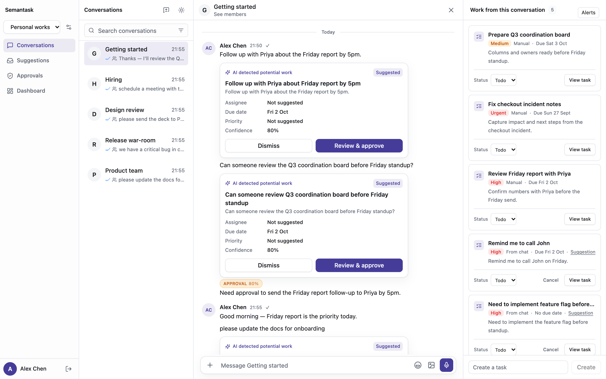
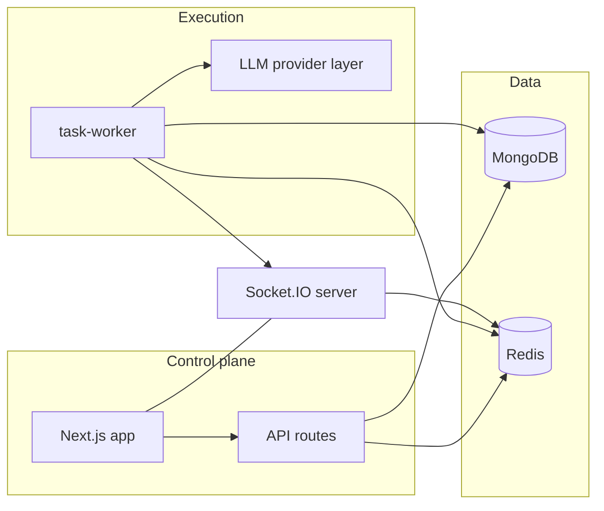

<div align="center">

# Semantask

**AI-native work coordination — teams talk, AI extracts the work, managers stay in control. Autonomy is optional.**

[semantask.com](https://semantask.com)

[](https://nodejs.org/)
[](https://turbo.build/)
[](https://nextjs.org/)

*Originally a real-time collaboration stack; evolved into a coordination platform with suggest-first AI, approvals, org visibility, and optional autonomous execution.*

</div>

<p align="center">
  
  <br />
  <sub>Natural conversation with live work visibility — suggestions, approvals, and optional run detail.</sub>
</p>

---

## Overview

**Semantask** is an AI-native work coordination platform. Teams communicate in realtime chat; AI extracts important work as suggestions; managers approve, assign, and see organization-wide status. **Autonomous tool execution** (async workers, leases, retries, multi-provider LLMs) is an **optional** capability behind policy — not the core experience.

Product direction: [ADR-005](docs/decisions/ADR-005-suggest-first-work-coordination.md) (roadmap lives in Notion, not this repo).

**Product contract:** Suggest → (approve when policy requires) → coordinate. Proposals and audit records are persisted before any tool execution. Autonomy is an optional, policy-gated capability — not the product promise. Execution mode is always enforced: false tool side effects under effective `suggest_only` are a **P0** product bug. See [ADR-005](docs/decisions/ADR-005-suggest-first-work-coordination.md).

## Why Semantask

| Theme | What you get |
| --- | --- |
| **Suggest-first extraction** | Chat → intents / proposed work; review before side effects (including task creation and audit writes). |
| **Manager control** | Approvals, tool grants, org policy, and audit trails. |
| **Org visibility** | Personal workspace by default; optional organizations (ADR-004). |
| **Realtime collaboration** | Socket.IO for messages, presence, and work updates. |
| **Optional autonomy** | Multi-provider LLM worker when policy allows — see [archived operator docs](docs/archive/optional-autonomy/). |

## Architecture


```mermaid
flowchart LR
  subgraph Control plane
    Web[Next.js app]
    API[API routes]
  end
  subgraph Data
    Mongo[(MongoDB)]
    Redis[(Redis)]
  end
  subgraph Execution
    Worker[task-worker]
    LLM[LLM provider layer]
  end
  Socket[Socket.IO server]
  Web --> API
  API --> Mongo
  API --> Redis
  Worker --> Mongo
  Worker --> Redis
  Worker --> LLM
  Worker --> Socket
  Socket --> Redis
  Web --- Socket
```

1. **Next.js** serves the UI and HTTP APIs; shared packages enforce validation and persistence.
2. **task-worker** classifies messages and (when policy allows) runs optional autonomous tasks via the LLM provider layer.
3. **MongoDB** stores durable conversations, suggestions/tasks, and domain state.
4. **Redis** backs coordination, queues, and scalable socket fan-out.
5. **Socket.IO** streams chat and work updates for realtime clients.

Full system map: [`docs/ARCHITECTURE.md`](docs/ARCHITECTURE.md). Optional LLM/worker operator docs: [`docs/archive/optional-autonomy/`](docs/archive/optional-autonomy/).

**Ingress note:** new chat messages are classified via `classifyMessage()` in `packages/services/task-intelligence.service.ts` using the current **regex/heuristic** path (`TASK_CLASSIFIER_MODE` defaults to `regex`). Product direction is **suggest-first** ([ADR-005](docs/decisions/ADR-005-suggest-first-work-coordination.md)). LLM providers are used for optional **task execution** (`task.execution.requested`); LLM ingress classification (`shadow` / `llm` modes) is available but not the default.

## Platform stack

| Layer | Technology |
| --- | --- |
| Monorepo | **Turborepo** — unified build, cache-friendly pipelines |
| Web | **Next.js 15** — App Router, API routes, auth integration |
| Data | **MongoDB** — durable tasks and application state |
| Coordination | **Redis** — queues, presence-style coordination, socket scaling |
| Real-time | **Socket.IO** — streaming updates to connected clients |
| Containers | **Docker Compose** — nginx, web, socket, worker, MongoDB, Redis |

## Monorepo layout

```text
.
├── apps/
│   ├── web/           # Next.js — UI, APIs, auth flows
│   ├── socket/      # Socket.IO — real-time observability transport
│   ├── task-worker/ # Task-intelligence/outbox worker; optional AgentRunner + tools when policy allows
│   └── mobile/      # React Native client (optional)
├── packages/
│   ├── auth/        # Shared auth utilities
│   ├── db/          # MongoDB models and access patterns
│   ├── redis/       # Redis helpers
│   ├── services/    # Domain logic, validators, repositories
│   └── types/       # Shared contracts and event shapes
├── docker/
├── nginx/
├── docker-compose.yml
└── turbo.json
```

## Prerequisites

- **Node.js** 20+
- **pnpm** 11+ (see `packageManager` in root `package.json`)
- **MongoDB** (replica set for production — see [`docs/operations/PRODUCTION_REQUIREMENTS.md`](docs/operations/PRODUCTION_REQUIREMENTS.md))
- **Redis** (required for production-like / multi-instance socket and task-worker dedupe)

## Environment configuration

Copy [`env.sample`](env.sample) to `.env` at the repository root and adjust for your environment.

**Core:** database, Redis, auth secrets (`ACCESS_TOKEN_SECRET` / `REFRESH_TOKEN_SECRET`), OAuth (optional), ImageKit (if media uploads are enabled), Resend (OTP, invites, and notifications).

**Task-worker runtime:** `TASK_*`, outbox/lease, and Redis settings in `env.sample` (needed for classification and outbox processing even when tools are off).

**Optional LLM / autonomy providers:** set `LLM_PROVIDER`, `LLM_API_KEY`, and `LLM_BASE_URL` when policy-enabled tool execution is used. Supports **OpenAI**, **OpenAI-compatible** bases (including **AMD**), and **Hugging Face**. See `env.sample`.

```env
# Core (abbreviated — see env.sample for full list)
MONGODB_URI=mongodb://localhost:27017/semantask
ACCESS_TOKEN_SECRET=replace_with_a_strong_secret
REFRESH_TOKEN_SECRET=replace_with_a_strong_secret
INTERNAL_SECRET=replace_with_shared_internal_secret
ORIGIN=http://localhost:3000
REDIS_URL=redis://localhost:6379
NEXT_PUBLIC_SOCKET_URL=http://localhost:3001

# Optional LLM / autonomy settings (see env.sample)
LLM_PROVIDER=openai
LLM_API_KEY=
# LLM_BASE_URL=             # OpenAI-compatible / vLLM / custom gateway
```

## Local development

1. Install dependencies.

```bash
pnpm install
```

2. Start all workspaces in development mode.

```bash
pnpm run dev
```

3. Open the apps.

- **Web:** http://localhost:3000  
- **Socket server:** http://localhost:3001  

Run the task worker explicitly when developing agents in isolation:

```bash
pnpm run task-worker
```

## Scripts

| Script | Description |
| --- | --- |
| `pnpm run dev` | Development mode for apps and packages via Turborepo |
| `pnpm run build` | Production builds across workspaces |
| `pnpm run start` | Starts production targets where defined |
| `pnpm run lint` | Lint across workspaces |
| `pnpm run test` | Tests across workspaces |
| `pnpm run task-worker` | Dev mode for the agent/task worker |
| `pnpm run clean` | Cleans build artifacts via Turborepo |

## Docker

```bash
docker compose up --build
```

The Compose stack includes **nginx**, **nextapp** (Next.js), **socket**, **task-worker**, and **Redis**. **MongoDB is external** — set `MONGODB_URI` in `.env` to a reachable **replica set** for production task-worker retries. See [`docs/operations/PRODUCTION_REQUIREMENTS.md`](docs/operations/PRODUCTION_REQUIREMENTS.md).

## Troubleshooting

- **Ports 3000 / 3001 in use** — stop conflicting processes and restart dev servers.
- **Auth failures** — verify `ACCESS_TOKEN_SECRET`, `REFRESH_TOKEN_SECRET`, and cookie/domain settings.
- **Socket / live updates** — check `ORIGIN`, `INTERNAL_SECRET`, and `NEXT_PUBLIC_SOCKET_URL`.
- **Agent or LLM errors** — confirm `LLM_PROVIDER`, API keys, and base URLs; for OSS endpoints, see [`docs/archive/optional-autonomy/oss-inference-compatibility.md`](docs/archive/optional-autonomy/oss-inference-compatibility.md).

## License

See [LICENSE](LICENSE).
