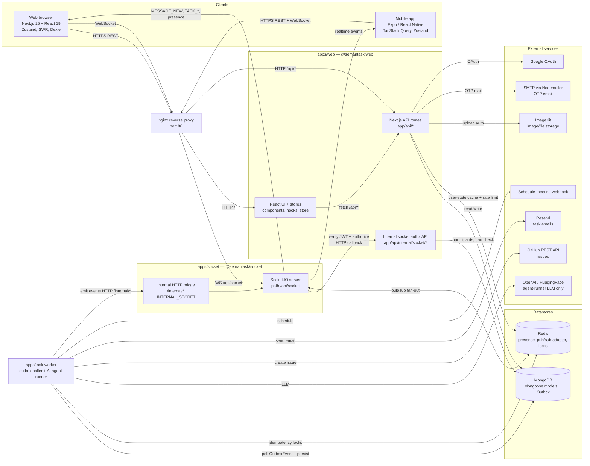
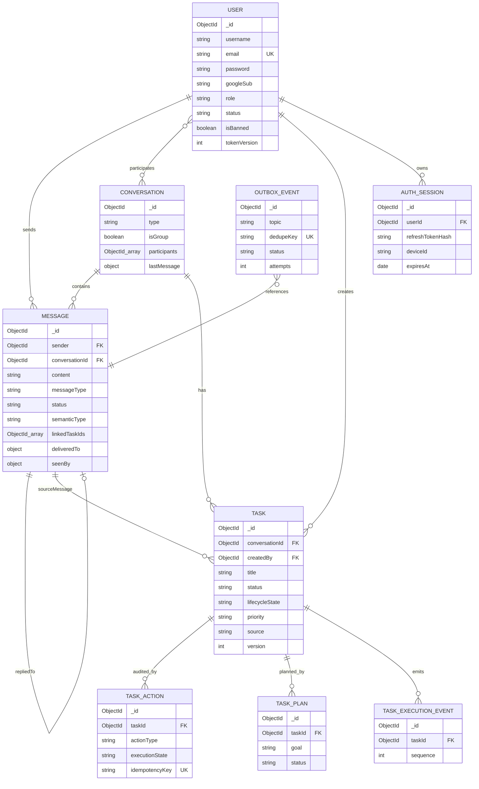

# Semantask — Architecture

> Grounded in the actual code in this repository. File paths are cited throughout so each
> component can be traced back to source. This is a **pnpm + Turborepo monorepo**
> (`pnpm-workspace.yaml`, `turbo.json`, root `package.json`) containing real-time chat plus an
> AI "task intelligence" layer.

## Architecture Status

| Field | Value |
|-------|-------|
| **Verification date** | 2026-07-01 |
| **Verified against commit** | `cff07cb887d7cde2b48069a3ca2d6da1dd63fca8` |
| **Roadmap version** | [Production Roadmap V1](./PRODUCTION_ROADMAP_V1.md) — Phase 0.1 |

Statements in this file describe **current runtime behavior** unless labeled **Planned / Future**.
For accepted design decisions, use the ADRs below instead of duplicating rationale here.

| Topic | ADR |
|-------|-----|
| Task lifecycle FSM (dual state, shadow mode) | [ADR-001](./decisions/ADR-001-task-lifecycle-state-machine.md) |
| Retry orchestration (outbox, task retry, idempotency) | [ADR-002](./decisions/ADR-002-retry-orchestration-strategy.md) |
| Socket authorization bridge | [ADR-003](./decisions/ADR-003-socket-authorization-bridge.md) |

Deeper flow detail: [`task-worker-execution-flow.md`](./architecture/task-worker-execution-flow.md),
[`realtime-messaging-system.md`](./architecture/realtime-messaging-system.md).
ADR implementation gaps (FIXED / OPEN / DEFERRED): [`adr-implementation-gap-audit.md`](./architecture/adr-implementation-gap-audit.md).
Production infra checklist: [`operations/PRODUCTION_REQUIREMENTS.md`](./operations/PRODUCTION_REQUIREMENTS.md).

## 1. System overview

The product is a multi-client chat application with three runtime services and a set of shared
workspace packages:

| Layer | Workspace | Tech | Source |
|-------|-----------|------|--------|
| Web client + API | `apps/web` (`@semantask/web`) | Next.js 15 App Router, React 19, Zustand, SWR, socket.io-client, Dexie | `apps/web/package.json` |
| Mobile client | `apps/mobile` (`mobile`) | Expo / React Native 0.81, React Navigation, TanStack Query, socket.io-client, Zustand | `apps/mobile/package.json` |
| Realtime server | `apps/socket` (`@semantask/socket`) | Express 5 + Socket.IO 4, `@socket.io/redis-adapter`, JWT | `apps/socket/index.ts`, `apps/socket/server/socket/index.ts` |
| Async worker | `apps/task-worker` (`@semantask/task-worker`) | Node worker loop, Mongoose, OpenAI / HuggingFace | `apps/task-worker/index.ts` |
| Shared packages | `packages/*` | `@semantask/types`, `@semantask/auth`, `@semantask/db`, `@semantask/services`, `@semantask/redis` | `packages/*/package.json` |

Infra (`docker-compose.yml`) wires these behind an **nginx** reverse proxy with **Redis** and
expects an external **MongoDB**:

- `nginx` (`nginx/default.conf`) terminates port 80, proxies `/` → `nextapp:3000` and
  `/api/socket` → `socket:3001` with WebSocket upgrade headers.
- `nextapp` — the Next.js web app/API (`docker/web.Dockerfile`).
- `socket` — the Socket.IO transport server (`docker/socket.Dockerfile`).
- `task-worker` — the outbox/AI worker (`apps/task-worker/Dockerfile`).
- `redis` (`redis:7.4-alpine`) — presence, Socket.IO pub/sub adapter, idempotency locks.

A key architectural decision: **the socket server is transport-only**. All persistence happens in
the Next.js API layer; the socket server just authenticates, authorizes (by calling back into the
web app), and fans out events. This is stated explicitly in
`apps/socket/server/socket/controllers/message.controller.ts`.

### High-level architecture diagram



## 2. Frontend (`apps/web`)

- **Framework**: Next.js 15 App Router with React 19 (`apps/web/package.json`, root override pins
  `next@15.5.18`, `react@19.1.0`). UI built with Radix UI + Tailwind v4 +
  `class-variance-authority` (`apps/web/components/ui/*`, `components.json`, `tailwind.config.ts`).
- **State management**: Zustand stores in `apps/web/store/` — `chat-store.ts` (messages/conversations),
  `useSocketStore.ts` (socket actions), `conversation-store.ts`, `task-store.ts`, `offline-store.ts`.
- **Server data**: `swr` plus an `authenticatedFetch` wrapper (`apps/web/lib/utils/api.ts`) that waits
  for auth bootstrap and single-flights token refresh.
- **Realtime client**: singleton `socket.io-client` in `apps/web/hooks/socketClient.tsx`
  (`path: "/api/socket"`, `withCredentials`, auto-reconnect). Global listeners handle `MESSAGE_NEW`,
  `MESSAGE_DELETE`, `MESSAGE_REACTION`, typing, and task events; task listeners are registered in
  `apps/web/hooks/socketListeners.ts`.
- **Offline support**: Dexie/IndexedDB queue (`packages/db/offlineMessages.ts`) populated by
  `apps/web/components/chat/message-input.tsx` when offline, flushed by
  `apps/web/hooks/useOfflineMessageSync.ts`.
- **How it talks to the backend**: HTTP REST to its own Next.js API routes for all reads/writes, and a
  WebSocket to the socket server for live fan-out.

### Backend API surface (Next.js route handlers, `apps/web/app/api`)

- **Auth** (`api/auth/*`): `login`, `register`, `refresh`, `logout`, `revoke-all-tokens`,
  `change-password`, `sendOtp`, `verify-otp`, `imagekit-auth`, Google OAuth `google/start` +
  `google/callback`, and step-up `challenge/{password,otp}` flows.
- **Messaging** (`api/messages/*`): `POST/GET /api/messages` plus per-message `edit`, `delete`,
  `react`, `seen`, `delivered`, `semantic` (`apps/web/app/api/messages/route.ts`).
- **Conversations / users** (`api/conversations`, `api/users`, `api/user/[email]`, `api/me`).
- **Tasks** (`api/tasks/*`, `api/task-approvals`): task list/detail, execution events, approvals.
- **Admin** (`api/admin/*`): dashboard, users, toggle ban, change role, auth events.
- **Internal — socket → web authorization** (`api/internal/socket/*`):
  `authorize-identity`, `authorize-conversation-access`, `authorize-message-action`; plus
  `api/internal/auth/step-up-status`. These are how the stateless socket server makes trust decisions.

## 3. Realtime layer (`apps/socket`)

- **Server**: Express 5 HTTP server hosting a Socket.IO server mounted at `path: "/api/socket"`
  (`apps/socket/index.ts`, `apps/socket/server/socket/io.ts`). `maxHttpBufferSize` and CORS origin
  allow-listing are enforced.
- **Horizontal scale**: when Redis is present it attaches `@socket.io/redis-adapter`
  (`io.adapter(createAdapter(pubClient, subClient))` in `io.ts`) so multiple socket instances share
  rooms; nginx `upstream socket_servers` is set up with `least_conn` for multiple instances.
- **Connection auth**: `io.use(socketAuth)` (`server/socket/middleware/auth.ts`) extracts a JWT from
  handshake auth, `Authorization: Bearer`, or the `accessToken` cookie, verifies it with **HS256**,
  then revalidates the user against MongoDB via `authorizeSocketIdentity` (calls the web
  `/api/internal/socket/authorize-identity`). Each socket joins a personal room `user:<userId>`.
- **Handlers** (registered per connection in `server/socket/index.ts`): message send, edit, delete,
  delivery (`delivered`/`seen`), typing, presence, conversation join/leave, admin, calls.
- **Message send path** (`server/socket/handlers/message/message.handler.ts`): on `MESSAGE_SEND` it
  calls `authorizeConversationAccess` (HTTP back to web) to get `participantIds`, verifies the sender,
  then emits `MESSAGE_NEW` to the conversation room and to each participant's `user:*` room. It uses
  Redis presence (`services/presence.redis.service.ts`) to derive `sent`/`delivered`/`seen` and emits
  `MESSAGE_DELIVERED_UPDATE` / `MESSAGE_SEEN_UPDATE` back to the sender.
- **Internal HTTP bridge** (`apps/socket/index.ts`): authenticated `/internal/*` endpoints
  (`message-deleted`, `message-reaction`, `message-delivered`, `message-seen`, `conversation-created`,
  `task-created`, `task-updated`, `task-linked-to-message`, `task-execution-updated`,
  `message-semantic-updated`). These let the web app and task-worker push fan-out events. Auth is a
  shared `INTERNAL_SECRET` header (`packages/types/utils/internal-bridge-auth.ts`).

## 4. AI task pipeline (`apps/task-worker`)

This is a separate process implementing a **transactional outbox** consumer. See
[ADR-002](./decisions/ADR-002-retry-orchestration-strategy.md) for retry and idempotency layers and
[`task-worker-execution-flow.md`](./architecture/task-worker-execution-flow.md) for the full control
flow.

### Current implementation

- `createMessage` (`packages/services/message.service.ts`) persists the `Message`, updates
  `Conversation.lastMessage`, and writes an `OutboxEvent{topic:"message.created"}` — all inside a
  Mongo transaction (with a no-transaction fallback for standalone Mongo).
- The worker loop (`apps/task-worker/index.ts`) claims `OutboxEvent`s via
  `@semantask/services/outbox.service` and dispatches by topic:
  - **`message.created`** → `processMessageTaskIntelligence`
    (`packages/services/task-intelligence.service.ts`). Ingress classification is **regex/heuristic**
    via `classifyMessage()` — not an LLM call. On match (confidence ≥ 0.7), the worker updates
    `Message.semanticType` / `semanticConfidence` / `linkedTaskIds`, may upsert a `Task`, writes
    `TaskAction` audit rows, enqueues `task.execution.requested`, and pushes socket events via
    `/internal/message-semantic-updated`, `/internal/task-created`, etc. (`AI_VERSION =
    "intelligent-v3-preprocess"`).
  - **`task.execution.requested`** / **`task.execution.approved`** → policy gate
    (`apps/task-worker/services/execution-policy.ts`), human-approval handling (`TaskAction`),
    distributed leases (`apps/task-worker/services/lease.service.ts` + Mongo `Task.leaseOwner`),
    and the autonomous `AgentRunner` (`apps/task-worker/services/agent-runner.ts`). **LLM providers**
    (`apps/task-worker/services/llm/*`, OpenAI / HuggingFace / OpenAI-compatible) are used here for
    planning, step decisions, reflection — not at message ingress.
  - **Lease-busy defer:** when `withExecutionLease` cannot acquire the mutex,
    `assertExecutionLeaseCompleted` throws `ExecutionLeaseBusyError`; the outbox loop calls
    `markOutboxEventDeferred` (restores the claim attempt increment) so the event is re-claimed
    after backoff — it is **not** completed while busy (`apps/task-worker/index.ts:1641-1649`).
  - **Run-independent tool idempotency:** `AgentRunner.buildToolIdempotencyKey` hashes
    `taskId | stepId | toolName | params` (no `runId`), so duplicate tool side effects are suppressed
    across lease handoffs (`agent-runner.ts:2734-2745`).
  - Tools call **GitHub**, **Resend**, and a **schedule-meeting webhook** via `ToolRegistry`, with
    verification registries and `guardIdempotentToolExecution` backed by unique `TaskAction.idempotencyKey`.
- Reliability: retry scheduler (`services/retry-scheduler.ts`), stuck-task detector
  (`services/stuck-task-detector.ts`), dead-letter on `OUTBOX_MAX_ATTEMPTS`, and per-event Redis dedupe keys.

### Planned / Future

Tracked in [Production Roadmap V1](./PRODUCTION_ROADMAP_V1.md) Phase 2+:

- **LLM message classifier** at ingress (replace `classifyMessage()` regex) — Milestone 2.1.
- **`MessageIntent` persistence** from classifier output — schema exists at
  `packages/db/models/MessageIntent.ts` but **no runtime writer** today; Milestone 2.3.
- Expanded intent taxonomy (`chat`, `incident`, `scheduling`, etc.) — Milestone 2.2.

## 5. Data layer

- **MongoDB via Mongoose** is the system of record. Models live in `packages/db/models/*`:
  `User`, `Conversation`, `Message`, `Task`, `TaskAction`, `TaskPlan`, `TaskMemory`,
  `TaskExecutionEvent`, `TaskReflection`, `OutboxEvent`, `OTP`, `StepUpChallenge`,
  `Devices`, `Contact`, `TempMessage`. Auth-specific collections (`AuthSession`, auth events) are in
  `packages/auth/repositories/*`.
  - **`MessageIntent`** (`packages/db/models/MessageIntent.ts`) — **schema only**; no production code
    writes to this collection yet (see Planned / Future in §4).
- **Redis** (`packages/redis/*`, `apps/socket/server/socket/services/presence.redis.service.ts`):
  presence/heartbeat with TTL, active-conversation tracking, message delivery state, the Socket.IO
  pub/sub adapter, worker idempotency/lease locks, and Upstash-based rate limiting
  (`@upstash/ratelimit`, used in `apps/web`).
- **Client-side IndexedDB** via Dexie (`packages/db/offlineMessages.ts`) for the offline send queue.

### Core data model (ER diagram)



> **Note:** `MessageIntent` is defined in Mongoose but omitted from this diagram — it is
> **Planned / Future** (Phase 2.3). Ingress classification today writes `Message.semanticType` and
> related fields only.

## 6. Authentication & authorization

- **Tokens**: short-lived JWT **access token** + **refresh token**, both signed **HS256**
  (`packages/auth/tokens/generate.ts`). Access tokens carry `sub`, `role`, and `tokenVersion`.
- **Sessions**: refresh tokens are hashed and stored as `AuthSession` rows with device/IP metadata and
  a TTL index (`packages/auth/repositories/sessionModel.ts`, `packages/auth/session/*`).
- **Login**: `loginUser` (`packages/auth/services/login.service.ts`) verifies bcrypt password
  (`packages/auth/password/*`), checks account status, then issues tokens + creates a session.
- **Additional flows**: Google OAuth (`packages/auth/services/google-oauth.service.ts`), OTP and
  step-up challenges (`otp.service.ts`, `step-up-otp.service.ts`, `step-up-password.service.ts`),
  token-version revocation, and audit logging (`auth-audit.service.ts`, `security-event-logger.ts`).
- **Web request guard**: `requireAuthUser` → `validateAuthUser` (Redis-cached user state)
  (`apps/web/lib/utils/auth/*`), plus `requireConversationAccess` and `requireAdminUser`.
- **Socket guard**: JWT verify + `authorizeSocketIdentity`; never trusts JWT claims alone — it
  revalidates existence/ban/deletion against MongoDB (`apps/socket/server/socket/middleware/auth.ts`).
- **Service-to-service**: the shared `INTERNAL_SECRET` header secures both the socket `/internal/*`
  endpoints and the web `/api/internal/*` endpoints (`packages/types/utils/internal-bridge-auth.ts`).

## 7. External integrations

- **ImageKit** — image/file storage and signed upload auth (`@imagekit/*`,
  `apps/web/app/api/auth/imagekit-auth`, `apps/web/lib/utils/imagekit.ts`).
- **OpenAI / HuggingFace / OpenAI-compatible** — LLM calls inside `AgentRunner`, planner, and
  reflection (`apps/task-worker/services/llm/*`). **Not** used for `message.created` ingress
  classification (regex heuristics in `task-intelligence.service.ts`).
- **GitHub REST API** — auto-created issues from tasks (`apps/task-worker/index.ts`).
- **Resend** — outbound task emails; **SMTP/Nodemailer** — OTP delivery from the web app.
- **Google OAuth** — federated login.
- **Schedule-meeting webhook** — pluggable meeting scheduling adapter (+ fallback webhooks).

## 8. Build / deploy / infra

- **Monorepo orchestration**: Turborepo (`turbo.json`) with pnpm workspaces (`pnpm-workspace.yaml`).
  Root scripts run `turbo run dev|build|start|lint|test|typecheck` across `apps/*` and `packages/*`.
- **Containers**: `docker/web.Dockerfile`, `docker/socket.Dockerfile`, `apps/task-worker/Dockerfile`,
  composed in `docker-compose.yml` (+ `docker-compose.worker.yml`) behind `nginx/default.conf`.
- **Config**: `.env` / `env.sample` provide `REDIS_URL`, `MONGODB_URI`, `ACCESS_TOKEN_SECRET`,
  `INTERNAL_SECRET`, `ORIGIN`, `SOCKET_SERVER_URL`, `WEB_SERVER_URL`, plus integration keys
  (`GITHUB_TOKEN`/`GITHUB_REPO`, `RESEND_API_KEY`, ImageKit, Google, LLM provider keys).
- **CI / release**: GitHub workflows in `.github/`, Changesets versioning (`.changeset/`), and
  `vercel.json` for the web deploy.

## 9. End-to-end: sending & receiving a chat message

The order is **persist-then-broadcast**. The client first writes through the Next.js API (which is
the only writer to MongoDB and enqueues the outbox event), then emits over the socket for live fan-out.
The socket server authorizes by calling back into the web app and uses Redis to compute delivery state.

```mermaid
sequenceDiagram
    autonumber
    actor Sender as Sender browser
    participant UI as Web UI store<br/>chat-store / useSocketStore
    participant API as Next.js API<br/>/api/messages
    participant Mongo as MongoDB
    participant SIO as Socket.IO server
    participant IntAPI as Web internal authz<br/>/api/internal/socket
    participant Redis as Redis
    participant Worker as task-worker
    actor Recv as Recipient client

    Note over Sender,SIO: Connection setup
    Sender->>SIO: WebSocket handshake with accessToken
    SIO->>IntAPI: authorize-identity (verify HS256 + ban check)
    IntAPI->>Mongo: load user, tokenVersion
    IntAPI-->>SIO: allowed + role
    SIO-->>Sender: connected, join personal user room

    Note over Sender,Mongo: 1. Persist via REST
    Sender->>UI: type message + submit
    UI->>UI: optimistic temp message<br/>queue in Dexie if offline
    UI->>API: POST /api/messages (cookie accessToken)
    API->>API: requireAuthUser + requireConversationAccess
    API->>Mongo: txn: insert Message + update lastMessage
    API->>Mongo: enqueue OutboxEvent message.created
    API-->>UI: 201 normalized message

    Note over UI,Recv: 2. Realtime fan-out
    UI->>SIO: emit MESSAGE_SEND (saved message)
    SIO->>IntAPI: authorize-conversation-access
    IntAPI->>Mongo: load participantIds
    IntAPI-->>SIO: allowed + participantIds
    SIO->>Redis: read presence / active conversation
    SIO-->>Recv: MESSAGE_NEW (conversation + user rooms)
    SIO-->>Sender: MESSAGE_DELIVERED_UPDATE / MESSAGE_SEEN_UPDATE
    Recv->>SIO: MESSAGE_SEEN when viewing
    SIO-->>Sender: MESSAGE_SEEN_UPDATE

    Note over Worker,Recv: 3. Async message intelligence (regex ingress)
    Worker->>Mongo: claim OutboxEvent message.created
    Worker->>Worker: classifyMessage() regex heuristics<br/>(task-intelligence.service.ts)
    Worker->>Mongo: update Message.semantic*; upsert Task / TaskAction if task-like
    Worker->>Mongo: enqueue task.execution.requested (when task created)
    Worker->>SIO: POST /internal/message-semantic-updated + task events
    SIO-->>Recv: MESSAGE_SEMANTIC_UPDATED / TASK_CREATED
    SIO-->>Sender: MESSAGE_SEMANTIC_UPDATED / TASK_CREATED

    Note over Worker,Recv: 4. Task execution (separate outbox event; uses LLM in AgentRunner)
```

### Notes / caveats grounded in code

- **Ingress classification is regex-based**, not LLM-based. See `classifyMessage()` in
  `packages/services/task-intelligence.service.ts` and Planned / Future in §4.
- The socket server **does not persist messages** — `message.controller.ts` returns a plain object and
  comments that persistence belongs to the web/API layer.
- Delivery/seen receipts are computed from **Redis presence**, not a DB read, on the hot path
  (`message.handler.ts` + `presence.redis.service.ts`); the DB `deliveredTo`/`seenBy` arrays are updated
  through the dedicated `/api/messages/[id]/delivered` and `/seen` routes.
- If Redis is absent the socket server logs a warning and runs **without** the adapter (single-instance
  only) — see `io.ts`.
