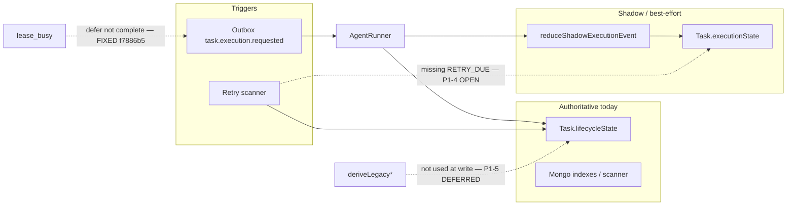

# ADR Implementation Gap Audit

**Date:** 2026-07-01 (reconciled)  
**Previous audit:** 2026-05-31  
**Verified against commit:** `cff07cb887d7cde2b48069a3ca2d6da1dd63fca8`  
**Roadmap:** [Production Roadmap V1](../PRODUCTION_ROADMAP_V1.md) — Phase 0.2  
**Scope:** [ADR-001](../decisions/ADR-001-task-lifecycle-state-machine.md) (task lifecycle FSM) and [ADR-002](../decisions/ADR-002-retry-orchestration-strategy.md) (retry orchestration)  
**Method:** Re-read ADRs against runtime paths in `apps/task-worker`, `packages/types/task/execution-state.ts`, `packages/db/models/OutboxEvent.ts`, and related tests. Documentation only — no code changes in this pass.

---

## Executive summary

Both ADRs remain **largely accurate** about what ships today: dual state on `Task` (legacy authoritative, FSM shadow), layered retries (outbox → scheduled task retry → tool/action dedupe), and honest “accepted limitations” sections.

**Since the 2026-05-31 audit**, two P0 correctness items were fixed in `f7886b5` (lease-busy outbox defer, run-independent tool idempotency). The remaining highest-risk **open** items are **legacy vs shadow divergence undetected** (P0 #3) and **operational consistency gaps** (P1: `RETRY_DUE`, policy shadow alignment, replica-set guard) before **cleanup** (dead `buildExecutionPlan`) and **enhancements** (cancellation, adaptive backoff).

Use the [status register](#status-register-p0p1) below as the single source for FIXED / OPEN / DEFERRED. Superseded findings from the prior audit are listed in [§Superseded findings](#superseded-findings-2026-05-31-audit).

---

## Superseded findings (2026-05-31 audit)

| ID | Prior claim | Resolution | Evidence |
|----|-------------|------------|----------|
| P0-1 | Lease-busy + outbox `complete` silently drops execution triggers | **FIXED** in `f7886b5` | `assertExecutionLeaseCompleted` throws `ExecutionLeaseBusyError` (`lease.service.ts:104-110`); outbox loop calls `markOutboxEventDeferred` (`index.ts:1641-1649`, `outbox.service.ts:104-119`); tests in `dispatch.lease-wrapper.test.ts` |
| P0-2 | Tool idempotency keyed by `runId` allows duplicate side effects | **FIXED** in `f7886b5` | `buildToolIdempotencyKey` hashes `taskId \| stepId \| toolName \| params` only — comment “run-independent” (`agent-runner.ts:2734-2745`); `idempotent-tool-execution.test.ts` |
| ADR-002 §2 | Idempotency key included `runId` | **Superseded** — ADR-002 updated in Phase 0.1 | `docs/decisions/ADR-002-retry-orchestration-strategy.md` §2 |
| Unresolved Q1 | Lease-busy semantics unclear | **Resolved** — defer, not complete | `ExecutionLeaseBusyError` → `markOutboxEventDeferred` |
| Unresolved Q2 | Idempotency scope per-run vs per-task | **Resolved** — per task+step+params across runs | `agent-runner.ts:2734-2745` |

---

## Status register (P0/P1)

| ID | Item | Status | Phase | Evidence |
|----|------|--------|-------|----------|
| **P0-1** | Lease-busy + outbox completion | **FIXED** (`f7886b5`) | — | `index.ts:1641-1649`, `lease.service.ts:104-110`, `dispatch.lease-wrapper.test.ts` |
| **P0-2** | Tool idempotency includes `runId` | **FIXED** (`f7886b5`) | — | `agent-runner.ts:2734-2745`, `idempotent-tool-execution.test.ts` |
| **P0-3** | Legacy vs shadow divergence undetected | **OPEN** | [Phase 1.1](../PRODUCTION_ROADMAP_V1.md) | No `state_diverged` logging; `deriveLegacy*` not used at write time |
| **P1-4** | Wire `RETRY_DUE` on retry scanner | **OPEN** | [Phase 1.3](../PRODUCTION_ROADMAP_V1.md) | `retry-scheduler.ts` sets `lifecycleState: "ready"` only; FSM unchanged until next `AgentRunner` run |
| **P1-5** | `deriveLegacy*` at write time (projection) | **DEFERRED** | [Phase 5.2](../PRODUCTION_ROADMAP_V1.md) | `execution-state.ts:143-203`; only referenced in tests today |
| **P1-6** | Policy/approval early exits — shadow FSM lag | **OPEN** | [Phase 1.2](../PRODUCTION_ROADMAP_V1.md) | `processTaskExecutionRequested` blocked/approval paths (`index.ts:1212-1320`) update legacy only; no `persistShadowExecutionState` for `POLICY_BLOCKED` / `POLICY_APPROVAL_REQUIRED` |
| **P1-7** | Replica-set assumption for retry scanner | **OPEN** (document) | [Phase 0.3](../PRODUCTION_ROADMAP_V1.md), [Phase 1.3](../PRODUCTION_ROADMAP_V1.md) | `retry-scheduler.ts` uses `withTransaction`; standalone Mongo fails each tick |
| **P2-8** | Dead `buildExecutionPlan` / `runExecutionPlan` | **OPEN** (debt) | [Phase 5.1](../PRODUCTION_ROADMAP_V1.md) | Defined `index.ts:969-1130`; zero callers |
| **P2-9** | Unify `RetryManager` schedules | **DEFERRED** | Phase 5+ | Hard-coded in `agent-runner.ts`, `retry-manager.ts` |
| **P2-10** | `RETRY_BUDGET_EXHAUSTED` vs `ERROR_OCCURRED` alignment | **OPEN** (debt) | Phase 1+ | `scheduleTaskRetry` sets legacy `failed` directly |
| **P2-11** | Stuck detector log-only | **OPEN** | [Phase 1.5](../PRODUCTION_ROADMAP_V1.md) | `stuck-task-detector.ts` — warn only |
| **P3-12** | Cancellation wiring | **DEFERRED** | [Phase 1.4](../PRODUCTION_ROADMAP_V1.md) | FSM models `CANCEL_*`; no emitters |
| **P3-13** | `Retry-After` / circuit breaker | **DEFERRED** | Phase 4+ | Not implemented |
| **P3-14** | Divergence audit job | **DEFERRED** | [Phase 1.1](../PRODUCTION_ROADMAP_V1.md) | Overlaps P0-3 |
| **P3-15** | Retry scanner batching | **DEFERRED** | [Phase 6.2](../PRODUCTION_ROADMAP_V1.md) | One row per 5 s tick per worker |

---

## ADR-001: Task lifecycle state machine

### What ADR-001 gets right

| Claim | Verified in code |
|--------|------------------|
| `Task.lifecycleState` is authoritative for indexes, retry scanner, lease queries | `Task` schema indexes; `runRetryScannerOnce` filters on `lifecycleState: "retry_scheduled"` |
| Legal legacy transitions enforced via `task-state-machine.ts` / `assertTransition` | Used on lifecycle writes from worker paths |
| Fine-grained FSM in `execution-state-machine.ts` + shadow via `execution-state-shadow.ts` | `reduceShadowExecutionEvent` swallows invalid transitions; never aborts run |
| Shadow on by default (`TASK_EXECUTION_FSM_SHADOW_MODE !== "0"`) | `AgentRunner.isShadowExecutionStateEnabled()` |
| `deriveLegacyLifecycleState` / `deriveLegacyTaskStatus` exist but are **not** used at write time | Only referenced in `apps/task-worker/tests/execution-state-machine.test.ts` |
| `AgentRunner` writes legacy (`updateTask` / `transitionLifecycle`) and FSM (`persistShadowExecutionState`) separately | Same file, non-transactional |
| `CANCEL_*` events modeled; no runtime emitters | Grep: only FSM reducer + unit tests |
| `stuck-task-detector` logs only; no remediation | `detectStuckTasksOnce` — warn log, no state change |
| Cancellation FSM `cancelled` has no matching legacy enum value | `deriveLegacyLifecycleState(cancelled)` → `"failed"` (schema has no `cancelled` lifecycle) |

### Accepted limitations (documented, not production-ready)

- **Shadow FSM is best-effort:** invalid transitions stay on `from`; `shadowError` in history; persist failures log and continue.
- **No reconciliation:** legacy vs `executionState` divergence is undetected in production (**P0-3 OPEN**).
- **Dual reducers:** programmer discipline keeps legacy and shadow aligned; not a runtime invariant.
- **Cancellation** is designed in the FSM but not wired from API/socket/worker (**P3-12 DEFERRED**).

### Gaps ADR-001 understates or code diverges

| # | Gap | Status | Notes |
|---|-----|--------|-------|
| 1 | **`RETRY_DUE` not emitted by retry scanner** | **OPEN** (P1-4) | `runRetryScannerOnce` promotes `lifecycleState: "ready"` and enqueues outbox; FSM stays stale until next `AgentRunner` emissions. Unit tests cover `RETRY_DUE`; production scanner does not. |
| 2 | **Policy / approval paths — no shadow FSM on early return** | **OPEN** (P1-6) | `processTaskExecutionRequested` (`index.ts:1212-1320`) updates legacy lifecycle only for blocked / approval_pending. |
| 3 | **`iteration` (FSM) vs `Task.iterationCount`** | **OPEN** (debt) | Independent counters; footgun during clarification resume. |

### ADR-001 accuracy: high

No material factual errors after reconciliation. Uncertain items (`optimisticConcurrency`, `policy_blocked → queued`) remain open questions in [§Unresolved questions](#unresolved-questions).

---

## ADR-002: Retry orchestration strategy

### What ADR-002 gets right

| Claim | Verified in code |
|--------|------------------|
| Outbox claim / retry / DLQ via `outbox.service` + worker loop | `processOneEvent` + `getOutboxFns()` |
| `OutboxEvent.dedupeKey` unique | `packages/db/models/OutboxEvent.ts:37` — `unique: true` |
| Task-level retry via `scheduleTaskRetry` + `classifyExecutionError` | Sets `lifecycleState: "retry_scheduled"`, `nextRetryAt`, increments `retryCount` |
| Retry scanner promotes one row per tick, transactional enqueue | `runRetryScannerOnce` — `withTransaction`, dedupe `task.execution.requested:<id>:retry:<count>` |
| Tool idempotency: SHA-256 of task/step/tool/params (**run-independent**) | `AgentRunner.buildToolIdempotencyKey` (`agent-runner.ts:2734-2745`) |
| Lease-busy → outbox defer (not complete) | `ExecutionLeaseBusyError` → `markOutboxEventDeferred` (`index.ts:1641-1649`) |
| Redis optional for processed-event dedupe | `processOneEvent` — without Redis, weaker at-least-once semantics |
| Classifier default: unknown errors → retryable (`network`) | `retry-classifier.ts` final branch |
| Scanner throughput ~1 task / 5s / worker | `RETRY_SCAN_INTERVAL_MS` default 5000, one `findOneAndUpdate` per tick |
| Independent counters (outbox attempts, `retryCount`, step attempts, etc.) | As documented |

### Accepted limitations (documented, not production-ready)

- No `Retry-After` / provider-aware backoff (**P3-13 DEFERRED**).
- No circuit breaker; fixed env backoff envelope.
- Retry scanner requires replica-set transactions (**P1-7 OPEN**).
- Layered idempotency insufficient for time-varying tool side effects.

### Gaps ADR-002 understates or code diverges

| # | Gap | Status | Notes |
|---|-----|--------|-------|
| 1 | ~~Lease-busy drops work but outbox completes~~ | **FIXED** (`f7886b5`) | See [§Superseded findings](#superseded-findings-2026-05-31-audit) |
| 2 | ~~Tool idempotency includes `runId`~~ | **FIXED** (`f7886b5`) | See [§Superseded findings](#superseded-findings-2026-05-31-audit) |
| 3 | **`buildExecutionPlan` / `runExecutionPlan` are dead code** | **OPEN** (P2-8) | Only defined in `index.ts:969-1130`; **never called**. Live execution always goes through `agentRunner.runTask` / `runTaskPersistent`. |
| 4 | **`TASK_AGENT_PERSISTENT_LOOP_ENABLED` toggles runner mode** | **OPEN** (documented) | Default `false` → `runTask`; `true` → `runTaskPersistent`. Both use `scheduleTaskRetry`; not legacy plan vs AgentRunner. |
| 5 | **`RETRY_BUDGET_EXHAUSTED` FSM event** | **OPEN** (P2-10) | Reducer supports it; runtime uses `ERROR_OCCURRED` → `failed` when budget exceeded. |
| 6 | **Stuck detector does not interact with retry** | **OPEN** (P2-11) | Logs only; no remediation. |

### ADR-002 uncertain items — resolved

| ADR “Uncertain” | Finding |
|-----------------|--------|
| `dedupeKey` uniquely indexed? | **Yes** — confirmed on schema |
| Legacy `RetryManager` vs persistent loop default? | **Clarified:** `buildExecutionPlan` path is **dead**; `RetryManager` still used inside `AgentRunner` for short inline retries; `scheduleTaskRetry` handles task-level backoff |
| Lease-busy semantics | **Resolved** in `f7886b5` — defer via `markOutboxEventDeferred` |
| Tool idempotency scope | **Resolved** in `f7886b5` — run-independent key |

---

## Smallest safe implementation sequence

Aligned with [Production Roadmap V1](../PRODUCTION_ROADMAP_V1.md). Items marked **DONE** shipped before this reconciliation.

### Phase A — Stop losing work (ADR-002) — **DONE**

1. ~~**Lease-busy:** defer outbox on `ExecutionLeaseBusyError`~~ — **FIXED** `f7886b5`
2. ~~**Tool idempotency:** run-independent key~~ — **FIXED** `f7886b5`
3. **Redis / outbox:** document production requirement — **OPEN** → Phase 0.3 runbook

### Phase B — Align dual state without flipping authority (ADR-001)

4. **Projection at write** — **DEFERRED** → Phase 5.2
5. **Scanner FSM `RETRY_DUE`** — **OPEN** → Phase 1.3
6. **Policy/approval shadow emit** — **OPEN** → Phase 1.2

### Phase C — Observability before cutover

7. **Divergence metric** — **OPEN** → Phase 1.1
8. **Stuck detector remediation** — **OPEN** → Phase 1.5

### Phase D — Authoritative FSM (ADR-001 future evolution)

9–11. Dual-read, index migration, remove legacy writes — **DEFERRED** → Phase 5.2+

### Phase E — Unified retry story (ADR-002 future evolution)

12. Delete dead plan executor — **OPEN** → Phase 5.1  
13. Optional: `Retry-After`; batch retry scanner — **DEFERRED** → Phase 6.2+

---

## Cross-cutting findings (both ADRs)

- **Authoritative chain:** outbox → worker → lease → `AgentRunner` → **legacy fields** → scanners/indexes.  
- **Parallel chain:** same runner → **shadow FSM** (may diverge, may skip events on policy early exits).  
- **Cutover blocker:** projection helpers exist; enforcement and atomic coupling do not (P1-5).

---

## Unresolved questions

1. ~~**Lease-busy product semantics**~~ — **Resolved:** defer via `markOutboxEventDeferred` (`f7886b5`).
2. ~~**Idempotency scope**~~ — **Resolved:** per `taskId+stepId+toolName+params` across runs (`f7886b5`).
3. **Cancelled vs failed lifecycle:** FSM `cancelled` projects to legacy `failed`. Acceptable for UI copy, or distinct terminal status? — **OPEN** (Phase 1.4).
4. **`optimisticConcurrency`:** Does `task.save()` under lease surface version conflicts? — **OPEN** (needs focused test).
5. **Dead code removal:** `buildExecutionPlan` has zero callers — safe to remove after team confirm? — **OPEN** → Phase 5.1.

---

## Files reviewed

- `docs/decisions/ADR-001-task-lifecycle-state-machine.md`
- `docs/decisions/ADR-002-retry-orchestration-strategy.md`
- `apps/task-worker/services/execution-state-machine.ts`
- `apps/task-worker/services/execution-state-shadow.ts`
- `apps/task-worker/services/agent-runner.ts`
- `apps/task-worker/services/lease.service.ts`
- `apps/task-worker/services/retry-scheduler.ts`
- `apps/task-worker/services/schedule-retry.ts`
- `apps/task-worker/services/retry-classifier.ts`
- `apps/task-worker/services/stuck-task-detector.ts`
- `apps/task-worker/index.ts` (`processTaskExecutionRequested`, `processOneEvent`, outbox loop)
- `packages/services/outbox.service.ts`
- `packages/types/task/execution-state.ts`
- `packages/db/models/OutboxEvent.ts`
- `apps/task-worker/tests/execution-state-machine.test.ts`
- `apps/task-worker/tests/dispatch.lease-wrapper.test.ts`
- `apps/task-worker/tests/idempotent-tool-execution.test.ts`

---

## Review notes (2026-07-01 reconciliation)

- Lease-busy path re-verified: `assertExecutionLeaseCompleted` throws → `markOutboxEventDeferred`; event not completed.
- `buildToolIdempotencyKey` re-verified: no `runId` in hash; comment at `agent-runner.ts:2734`.
- `runExecutionPlan` / `buildExecutionPlan` call sites: **no invocations** — P2-8 remains open debt.
- Retry scanner does not touch `executionState` — P1-4 remains open.
- ADR-002 updated in Phase 0.1 for tool idempotency and lease-busy defer rows.

**Non-goals for this pass:** runtime code changes, README/marketing edits, git commit.
