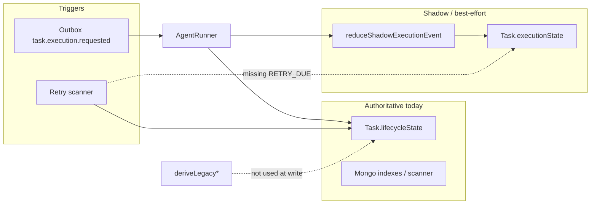

# ADR Implementation Gap Audit

**Date:** 2026-05-31  
**Scope:** [ADR-001](../decisions/ADR-001-task-lifecycle-state-machine.md) (task lifecycle FSM) and [ADR-002](../decisions/ADR-002-retry-orchestration-strategy.md) (retry orchestration)  
**Method:** Read ADRs against runtime paths in `apps/task-worker`, `packages/types/task/execution-state.ts`, `packages/db/models/OutboxEvent.ts`, and related tests. Documentation only — no code changes in this pass.

---

## Executive summary

Both ADRs are **largely accurate** about what ships today: dual state on `Task` (legacy authoritative, FSM shadow), layered retries (outbox → scheduled task retry → tool/action dedupe), and honest “accepted limitations” sections.

The gaps are not “the ADRs lie”; they are **intentional partial implementation** plus a few **code paths the ADRs describe as active but are dead or divergent**. The highest-risk items are **correctness** (lease-busy + outbox completion, tool idempotency keyed by `runId`) before **cleanup** (dead `buildExecutionPlan`, unified retry budgets) before **enhancements** (cancellation wiring, `RETRY_DUE` on scanner, adaptive backoff).

---

## ADR-001: Task lifecycle state machine

### What ADR-001 gets right

| Claim | Verified in code |
|--------|------------------|
| `Task.lifecycleState` is authoritative for indexes, retry scanner, lease queries | `Task` schema indexes; `runRetryScannerOnce` filters on `lifecycleState: "retry_scheduled"` |
| Legal legacy transitions enforced via `task-state-machine.ts` / `assertTransition` | Used on lifecycle writes from worker paths |
| Fine-grained FSM in `execution-state-machine.ts` + shadow via `execution-state-shadow.ts` | `reduceShadowExecutionEvent` swallows invalid transitions; never aborts run |
| Shadow on by default (`TASK_EXECUTION_FSM_SHADOW_MODE !== "0"`) | `AgentRunner.isShadowExecutionStateEnabled()` |
| `deriveLegacyLifecycleState` / `deriveLegacyTaskStatus` exist but are **not** used at write time | Only referenced in `apps/task-worker/tests/execution-state-machine.test.ts` |
| `AgentRunner` writes legacy (`updateTask` / `transitionLifecycle`) and FSM (`persistShadowExecutionState`) separately | Same file, non-transactional |
| `CANCEL_*` events modeled; no runtime emitters | Grep: only FSM reducer + unit tests |
| `stuck-task-detector` logs only; no remediation | `detectStuckTasksOnce` — warn log, no state change |
| Cancellation FSM `cancelled` has no matching legacy enum value | `deriveLegacyLifecycleState(cancelled)` → `"failed"` (schema has no `cancelled` lifecycle) |

### Accepted limitations (documented, not production-ready)

- **Shadow FSM is best-effort:** invalid transitions stay on `from`; `shadowError` in history; persist failures log and continue.
- **No reconciliation:** legacy vs `executionState` divergence is undetected in production.
- **Dual reducers:** programmer discipline keeps legacy and shadow aligned; not a runtime invariant.
- **Cancellation** is designed in the FSM but not wired from API/socket/worker.

### Gaps ADR-001 understates or code diverges

1. **`RETRY_DUE` is not emitted by the retry scanner.** ADR-001 says the scanner should emit `RETRY_DUE` in the same transaction as enqueue. `runRetryScannerOnce` only sets `lifecycleState: "ready"` and enqueues outbox; FSM stays on prior shadow state until the next run’s `AgentRunner` emissions. Unit tests cover `RETRY_DUE`; production scanner does not.
2. **Policy / approval paths in `processTaskExecutionRequested` update legacy lifecycle only** (blocked / approval_pending) with **no** matching `persistShadowExecutionState` for `POLICY_BLOCKED` / `POLICY_APPROVAL_REQUIRED` on those early returns — shadow can lag before `AgentRunner` starts.
3. **`iteration` (FSM) vs `Task.iterationCount` (document)** remain independent; ADR notes this but it is an active footgun during clarification resume.

### ADR-001 accuracy: high

No material factual errors. Uncertain items in ADR-001 (optimistic concurrency under lease, `policy_blocked → queued`) remain open questions below.

---

## ADR-002: Retry orchestration strategy

### What ADR-002 gets right

| Claim | Verified in code |
|--------|------------------|
| Outbox claim / retry / DLQ via `outbox.service` + worker loop | `processOneEvent` + `getOutboxFns()` |
| `OutboxEvent.dedupeKey` unique | `packages/db/models/OutboxEvent.ts:37` — `unique: true` |
| Task-level retry via `scheduleTaskRetry` + `classifyExecutionError` | Sets `lifecycleState: "retry_scheduled"`, `nextRetryAt`, increments `retryCount` |
| Retry scanner promotes one row per tick, transactional enqueue | `runRetryScannerOnce` — `withTransaction`, dedupe `task.execution.requested:<id>:retry:<count>` |
| Tool idempotency: SHA-256 of task/run/step/tool/params | `AgentRunner.buildToolIdempotencyKey` |
| Redis optional for processed-event dedupe | `processOneEvent` — without Redis, weaker at-least-once semantics |
| Classifier default: unknown errors → retryable (`network`) | `retry-classifier.ts` final branch |
| Scanner throughput ~1 task / 5s / worker | `RETRY_SCAN_INTERVAL_MS` default 5000, one `findOneAndUpdate` per tick |
| Independent counters (outbox attempts, `retryCount`, step attempts, etc.) | As documented |

### Accepted limitations (documented, not production-ready)

- No `Retry-After` / provider-aware backoff.
- No circuit breaker; fixed env backoff envelope.
- Retry scanner requires replica-set transactions (single-node Mongo fails every tick).
- Layered idempotency insufficient for time-varying tool side effects.

### Gaps ADR-002 understates or code diverges

1. **Lease-busy drops work but outbox still completes (P0 correctness).**  
   `processTaskExecutionRequested` returns quietly when `withExecutionLease` yields `{ skipped: "lease_busy" }` (`index.ts` ~1416–1423). `processOneEvent` then calls `complete(eventId)` for `task.execution.requested` (~1558–1561). The trigger is **acked without retry scheduling** — duplicate protection does not re-deliver unless something else re-enqueues.

2. **Tool idempotency includes `runId` (P0 correctness).**  
   `buildToolIdempotencyKey` hashes `taskId|runId|stepId|toolName|params`. After lease handoff or a new run id, the same logical tool call gets a **new** key → duplicate side effects possible under at-least-once delivery.

3. **`buildExecutionPlan` / `runExecutionPlan` are dead code.**  
   Only defined in `index.ts`; **never called**. Live execution always goes through `agentRunner.runTask` / persistent loop. ADR-002’s “legacy path is default” framing is misleading: the **inline `RetryManager` block inside `buildExecutionPlan`** is unreachable; `RetryManager` still exists on `AgentRunner` for in-process tool retries. Cleanup is still warranted (delete or quarantine dead path) but it is not the active execution router.

4. **`TASK_AGENT_PERSISTENT_LOOP_ENABLED` toggles runner mode, not legacy vs AgentRunner.**  
   Default `false` → `runTask`; `true` → `runTaskPersistent`. Both use `scheduleTaskRetry` for task-level backoff; semantics differ in step loop / checkpoints, not in outbox vs plan executor.

5. **`RETRY_BUDGET_EXHAUSTED` FSM event** — reducer supports it; runtime uses `ERROR_OCCURRED` → `failed` when budget exceeded (`scheduleTaskRetry` sets legacy `failed` directly). Shadow history may not mirror ADR’s ideal event algebra.

6. **Stuck detector does not interact with retry** — ADR-002 references lease recovery; stuck tasks are logged only.

### ADR-002 uncertain items — resolved

| ADR “Uncertain” | Finding |
|-----------------|--------|
| `dedupeKey` uniquely indexed? | **Yes** — confirmed on schema |
| Legacy `RetryManager` vs persistent loop default? | **Misleading label:** legacy *plan* path unused; AgentRunner + `scheduleTaskRetry` is live; `RetryManager` still used inside AgentRunner for short inline retries |

---

## Risk ranking

### P0 — Correctness (fix before cutover or scale)

1. **Lease-busy + outbox `complete`** — silent loss of execution triggers.  
2. **Tool idempotency keyed by `runId`** — duplicate external effects after rerun / steal.  
3. **Legacy vs shadow divergence undetected** — wrong UI/scheduling if FSM promoted early without projection enforcement.

### P1 — Operational / consistency (before FSM authoritative)

4. **Wire `RETRY_DUE` (or equivalent) on retry scanner** — align FSM history with lifecycle promotion.  
5. **Use `deriveLegacy*` at write time** (or single reducer write path) — one source of truth per save.  
6. **Early policy/approval exits** — emit shadow events or block until FSM matches legacy.  
7. **Replica-set assumption** — document/deploy guard for retry scanner transactions.

### P2 — Cleanup / debt

8. Remove or gate dead `buildExecutionPlan` / `runExecutionPlan` / index-level `withIdempotencyGuard` in unreachable block.  
9. Unify `RetryManager` schedules (env-driven single policy).  
10. Align `retryCount` / FSM `retry_scheduled` / `RETRY_BUDGET_EXHAUSTED` event usage.  
11. Stuck detector → remediate (schedule retry or fail) not only log.

### P3 — Enhancements (post-hardening)

12. Cancellation via outbox + `CANCEL_REQUESTED` / `CANCEL_FINALIZED`.  
13. `Retry-After`, per-action-type `RetryPolicy`, circuit breaker.  
14. Divergence audit job / `state_diverged` execution events.  
15. Retry scanner batching for throughput.

---

## Smallest safe implementation sequence

Ordered to maximize safety per unit of change. Each step should ship with tests and a short runbook note.

### Phase A — Stop losing work (ADR-002, no FSM cutover)

1. **Lease-busy:** On `lease_busy`, do **not** complete the outbox event — `fail` with backoff or leave pending and rely on lease expiry + re-delivery. Add integration test: concurrent workers, one busy, event not completed.
2. **Tool idempotency:** Remove `runId` from `buildToolIdempotencyKey` (or use stable `executionRunId` only when intentionally scoped per run). Extend `idempotent-tool-execution.test.ts` for lease-steal scenario.
3. **Redis / outbox:** Document requirement for production; optional hard fail if Redis unset in prod profile.

### Phase B — Align dual state without flipping authority (ADR-001)

4. **Projection at write:** After each `reduceExecutionState` (strict mode behind flag), set `lifecycleState` / `status` from `deriveLegacy*` in the **same** `updateOne` as `executionState`. Keep shadow catch for transition validation only during bake-in.
5. **Scanner FSM:** In `runRetryScannerOnce`, append shadow `RETRY_DUE` (or strict reducer) in the same transaction as lifecycle `ready` + enqueue.
6. **Policy/approval path:** Emit `POLICY_BLOCKED` / `POLICY_APPROVAL_REQUIRED` on early returns in `processTaskExecutionRequested`.

### Phase C — Observability before cutover

7. **Divergence metric:** Compare `deriveLegacyLifecycleState(executionState)` vs `lifecycleState` after saves; log `state_diverged` when mismatch (sampled).
8. **Stuck detector:** Transition to `failed` or enqueue diagnostic retry when heartbeat stale beyond threshold.

### Phase D — Authoritative FSM (ADR-001 future evolution)

9. Dual-read phase: APIs read `executionState.kind` with legacy fallback.
10. Migrate indexes (`retry_scheduled`, lease) to partial indexes on `executionState` fields (schema already partial-indexed).
11. Remove legacy enum writes; deprecate `task-state-machine.ts` transitions that contradict FSM.

### Phase E — Unified retry story (ADR-002 future evolution)

12. Delete dead plan executor; single `RetryPolicy` type for inline + scheduled retries.
13. Optional: honor `Retry-After`; batch retry scanner.

---

## Cross-cutting findings (both ADRs)

- **Authoritative chain:** outbox → worker → lease → `AgentRunner` → **legacy fields** → scanners/indexes.  
- **Parallel chain:** same runner → **shadow FSM** (may diverge, may skip events).  
- **Cutover blocker:** projection helpers exist; enforcement and atomic coupling do not.

---

## Unresolved questions (before implementation)

1. **Lease-busy product semantics:** Should busy mean “defer” (outbox retry) or “another worker owns it” (complete as no-op)? Today it behaves like no-op + complete — likely wrong for the former interpretation.
2. **Idempotency scope:** Should a tool be idempotent per *task+step+params* across all runs, or per *run* intentionally? ADR-002 implies parameter-stable dedupe; `runId` in the key suggests per-run — confirm intended semantics for email/send tools.
3. **Cancelled vs failed lifecycle:** FSM `cancelled` projects to legacy `failed`. Is that acceptable for UI copy, or do we need a distinct terminal status?
4. **`optimisticConcurrency`:** Does `task.save()` under lease ever surface version conflicts in production? ADR-001 lists as uncertain — add a focused test.
5. **Dead code removal:** Can `buildExecutionPlan` be deleted outright, or is it kept for a flagged rollout? Grep shows zero callers — safe to remove after team confirm.

---

## Files reviewed

- `docs/decisions/ADR-001-task-lifecycle-state-machine.md`
- `docs/decisions/ADR-002-retry-orchestration-strategy.md`
- `apps/task-worker/services/execution-state-machine.ts`
- `apps/task-worker/services/execution-state-shadow.ts`
- `apps/task-worker/services/agent-runner.ts`
- `apps/task-worker/services/retry-scheduler.ts`
- `apps/task-worker/services/schedule-retry.ts`
- `apps/task-worker/services/retry-classifier.ts`
- `apps/task-worker/services/stuck-task-detector.ts`
- `apps/task-worker/index.ts` (`processTaskExecutionRequested`, `processOneEvent`)
- `packages/types/task/execution-state.ts`
- `packages/db/models/OutboxEvent.ts`
- `apps/task-worker/tests/execution-state-machine.test.ts`

---

## Review notes (accuracy pass)

- Re-read lease-busy → `complete` path: confirmed silent return then `await complete(eventId)`.
- Re-read `runExecutionPlan` / `buildExecutionPlan` call sites: **no invocations** — ADR-002 wording adjusted in this report, not in the ADR itself.
- `OutboxEvent.dedupeKey` uniqueness: confirmed — ADR-002 uncertain item closed.
- Retry scanner does not touch `executionState` — ADR-001 `RETRY_DUE` gap confirmed.

**Non-goals for this audit (per plan):** secret rotation, runner/worker code changes, README/marketing edits, git commit.
